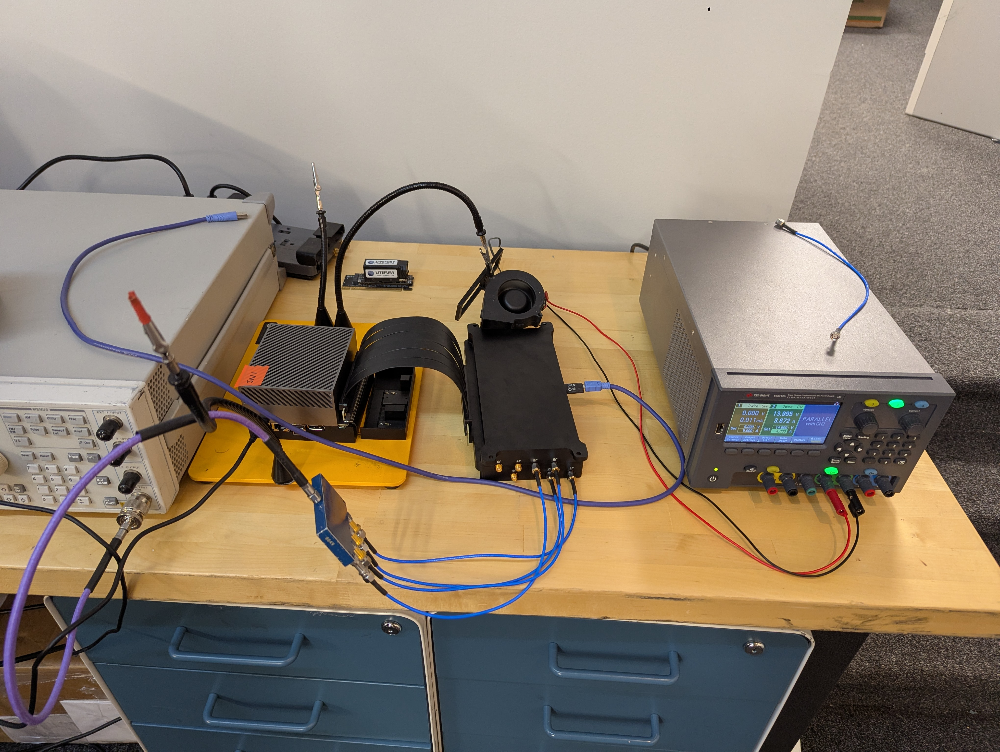

# Queens Canyon Capture Software

This project provides a high-speed data capture and control interface for the Queens Canyon hardware. It supports streaming data via PCIe (XDMA), web-based control and visualization, and hardware parameter management.

## Prerequisites: Xilinx XDMA Driver

Before running the software, you must install the Xilinx XDMA drivers.

1.  **Clone the driver repository:**
    ```bash
    git clone https://github.com/Xilinx/dma_ip_drivers.git
    cd dma_ip_drivers/XDMA/linux-kernel/xdma
    ```

2.  **Build and install the driver:**
    ```bash
    make
    sudo make install
    ```

3.  **Load the driver:**
    ```bash
    sudo insmod xdma.ko
    ```
    *Note: You may need to verify the device file created (e.g., `/dev/xdma0_c2h_0`) matches what the software expects.*

For more detailed instructions or troubleshooting, refer to the [Xilinx dma_ip_drivers repository](https://github.com/Xilinx/dma_ip_drivers).

## Hardware Setup and First Power On

The test setup looks like this:



1.  **Mounting:** The Queens Canyon unit should be mounted upside down. This is because the ADCs and FPGA are heatsinked to the bottom of the system.
2.  **PCIe Connection:** Connect the PCIe riser cable to your host system (e.g., an AGX Orin).
3.  **Power Supply:** Connect a power supply that can provide at least 14V and 4A.
4.  **Initial Startup Sequence:**
    -   Boot the host system (e.g., AGX Orin).
    -   Ensure the Xilinx XDMA drivers are installed and loaded.
    -   Power on the Queens Canyon unit.
    -   Wait for the unit to draw approximately **14V ~3.5A**. (It will initially draw ~2A before the FPGA is fully initialized).
5.  **PCIe Reset:** Once initialized, run the application with the reset flag to restart the PCIe bus so the host can detect it:
    ```bash
    ./capture_sw -r
    ```
    *Note: If you have problems connecting to the device at any time, run it with `-r` to restart the PCIe bus.*
6.  **Cooling:** A cooling fan or a cooling plate must be applied to the unit to ensure proper thermal management.

## Building

**Note:** Pre-compiled binary releases of the `capture_sw` application are available for download in the "Releases" section of this repository. This allows you to use the software without needing to set up a Go development environment.

To build the main application from source:

```bash
go build -o capture_sw .
```

## Usage

The application can run in **CLI Mode** for batch data capture or **Server Mode** for real-time visualization and control.

### Common Flags
- `-d <path>`: Path to the XDMA device (default: `/dev/xdma0_c2h_0`).
- `-r`: Reset PCIe device before starting.

### CLI Mode (Capture to File)

Capture data directly to a file. You can specify the capture duration or size.

**Examples:**

1.  **Capture 10 seconds of data from channels 1, 2, and 3:**
    ```bash
    ./capture_sw -o output.bin -channels 1,2,3 -t 10s
    ```

2.  **Capture 500MB of data:**
    ```bash
    ./capture_sw -o output.bin -s 500MB
    ```

3.  **Capture specific number of samples:**
    ```bash
    ./capture_sw -o output.bin -n 1000000
    ```

**CLI Flags:**
- `-o <filename>`: Output file path. If omitted, data is not saved.
- `-channels <list>`: Comma-separated list of channels (1-8) to capture (default: "1,2,3,4,5,6,7,8").
- `-t <duration>`: Capture duration (e.g., `10s`, `500ms`). Overrides `-n` and `-s`.
- `-n <int>`: Number of samples to capture. Overrides `-s`.
- `-s <size>`: Capture size (e.g., `100MB`, `1GB`). Default is 100MB.
- `-c <file>`: Hardware configuration JSON file path.
- `-bench`: Run in benchmark mode (continuous capture to RAM without saving).

### Server Mode (Web UI)

Start the WebSocket server and Web UI for live monitoring and control.

**Example:**
```bash
./capture_sw -server -p 8080
```

Open a browser and navigate to `http://localhost:8080`.

**Server Flags:**
- `-server`: Enable server mode.
- `-p <port>`: Port to listen on (default: 8080).